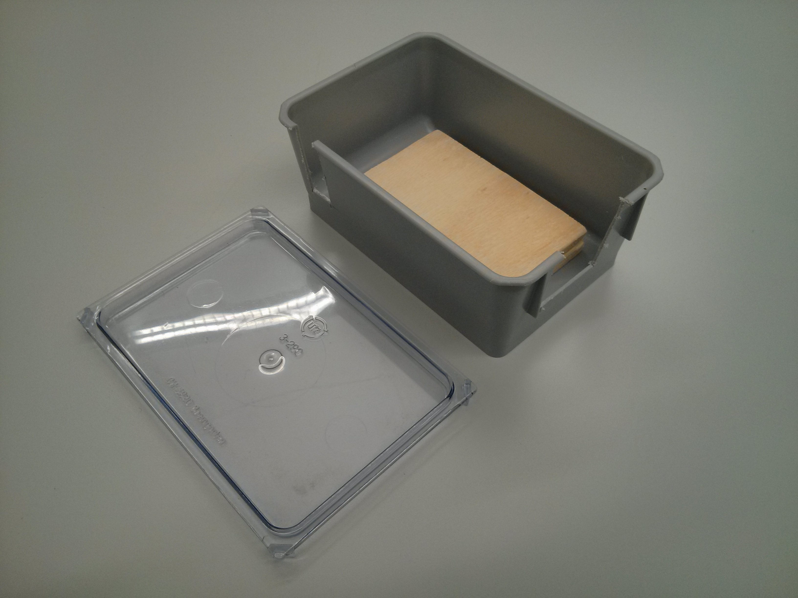
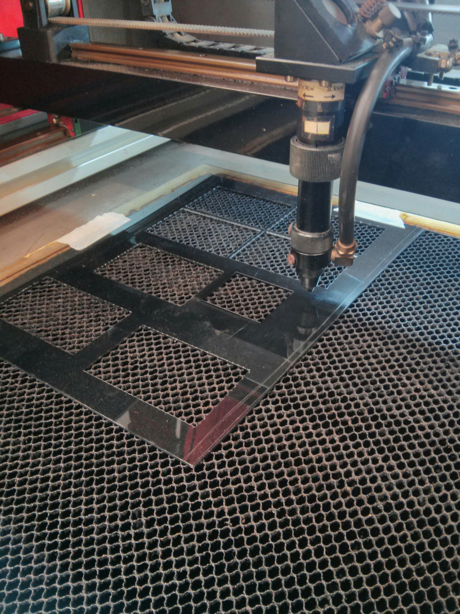

# Description

The am of this project is to turn the Raspberry Pi into a simple to use stream and recording station using off the shelf compontents and custom software.

# Sponsor

(Sponsor Info hinzfügen)

# Assembly

We recommend adding a LCD-display as it used to show status information and most importantly the current IP-address of the machine. It is certainly also possible to get hold of the IP-address in other, slighty more complicated, ways.

We built an enclosure to shelter the computer, the display and the cables.

## LCD-display

We use [this 16x2 LCD kit from adafruit.com](http://www.adafruit.com/products/1110).

## Enclosure

* Install spacer
    
I glued a piece of wood with the approximate size of the Raspberry to the bottom of the enclosure.

 

* Adding holes
    
Cut holes in the side of the enclosure so the connectors fit. 

    
* Cover for the connectors

To protect the board and the display cut out covers and glue them onto the enclosure.

* Attach computer
    
Screw the board onto the spacer. Connect the cables from the outside.

#[How to run it](https://github.com/faebser/pi-stream/blob/master/docs/en/manual.md)
