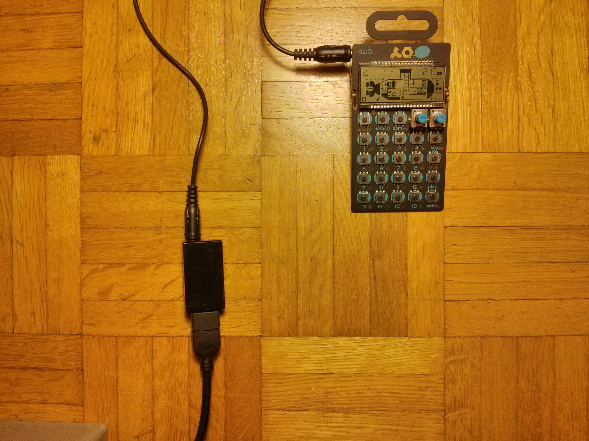
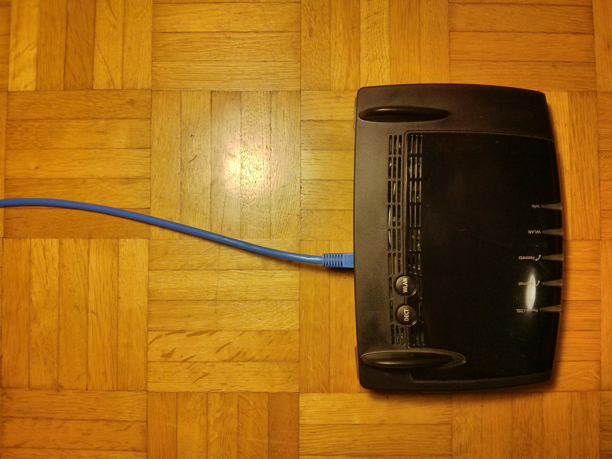
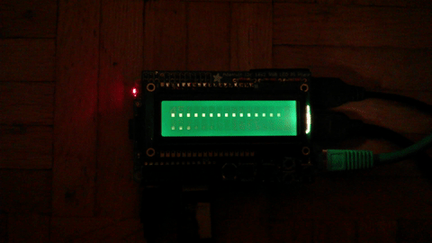

# Inbetriebnahme

Vor Inbetriebnahme alle Kabel ausstecken.

* Als erste das USB Kabel mit der USB-Aufnahmegerät und der Soundquelle verbinden.

* Dann das Netzwerkkabel mit dem Router verbinden

* Den Rechner an den Strom anschliessen

* Der Rechner startet und die beiden Status-LED an der Seite des Rechners beginnen zu blinken.

* Nach ungefähr einer Minute wird das Streaming-Programm gestartet.

* Die Software benötigt einen kurzen Augenblick um alle Status-Tests durchzuführen.

* Falls alle Tests ohne Probleme ausgeführt wurden, erscheint die Meldung mit der IP-Adresse des Rechners auf dem LCD-Display.

* Anschliessend zeigt das LCD die Status-Meldungen der Software an. Es gibt drei verschiedene Arten von Meldungen:
    * **grüner Hintergrundfarbe**: Alles gut (z.B. IP-Adresse, Streaming)
    * **gelber Hintergrundfarbe**: Achtung, evtl ein Problem (z.B. Speicherplatz wird knapp, Soundkarte nicht erkannt)
    * **roter Hintergrundfarbe**: kritischer Fehler (z.B. keine Netzwerkverbindung, keine Verbindung zum Server)

# Zur [Benutzeroberfläche](https://github.com/faebser/pi-stream/blob/master/docs/software.md)

