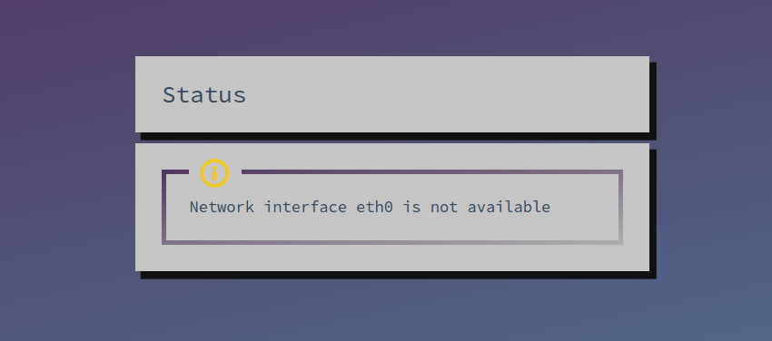

# User interface

To reach the user interface, simply enter the IP address of the raspberry pi into your browser.

The interface is made up out of a few components.

## Navigation

The navigation consists of two links:
* nonoradio.net links to the homepage of the project
* Documentation links to this documentation 

## Stream configuration

Use this component to input the data of the stream.
Both Name and Description are required.

Inputfields marked with a red cross are invalid, please fix them.
A stream cannot be started ss long as there are inputs marked as invalid.

* Name
    
    Name of the stream, one word is optimal. 
* Description
    
    A short description of the stream, max 5 words.
* URL
    
    A valid url (http is optional) pointing to more information on the stream.
* Genre
    
    The genre of the stream. Optional.

## Status
This component displays the same status messages as does the LCD display but adds additional information and a  colored symbol to display the error level.

As long as this component contains an an error, the stream button is deactivated.

## Buttons
Use these buttons to either start the stream or rerun the test.

E.g. if you forgot to plugin the network cable during startup there will be an error displayed in the status component. Rerun the tests to remove it.

## Recordings
This component contains a list of all the available recordings on the machine. To delete a recording click twice on the **X**.

