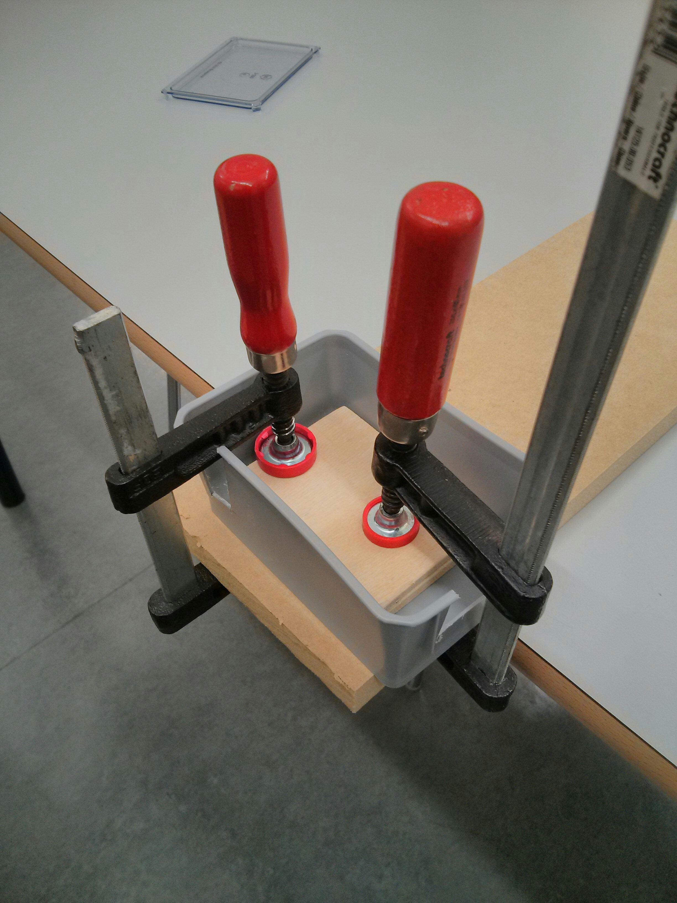

# Beschreibung

Diese Projekt versucht aus dem Raspberry Pi mit handelsüblichen Komponenten,
angepasstem Betriebssystem und Software einen
einfach zu bedienenden Stream- und Aufnahmestation zu machen.

# Sponsor

(Sponsor Info hinzfügen)

# Zusammenbau

Wir empfehlen die Nutzung eines LCD-Displays, da dies für die Ausgabe der aktuellen IP-Adresse genutzt wird. Die IP-Adresse des Rechners kann jedoch auch über andere Wege ermittelt werden.

Für unsere Version haben wir ein Gehäuse gebaut um den Rechner und die Komponenten zu schützen.

## LCD-Display

Wir haben [dieses 16x2 LCD Kit von adafruit.com](http://www.adafruit.com/products/1110) verbaut.

## Gehäuse

* Abstandshalter einbauen
    
Ich habe ein Stück Holz mit der ungefähren Grösse des Rechners augeschnitten und in das Gehäuse geklebt.

 

* Löcher in Behälter schneiden
    
Die Grösse der Anschlüsse abmessen, diese auf dem Gehäuse markieren
und auschneiden.

    
* Abdeckungen für Löcher zuschneiden
    Um den Rechner und das Display zu schützen, Abdeckungen für die Kabel
    zuschneiden und sie aussen auf das Gehauses kleben.

* Rechner befestigen
    Den Rechner auf dem Abstandhalter befestigen. Die Kabel von aussen
    in das Gehäuse schieben und anschliessen.

